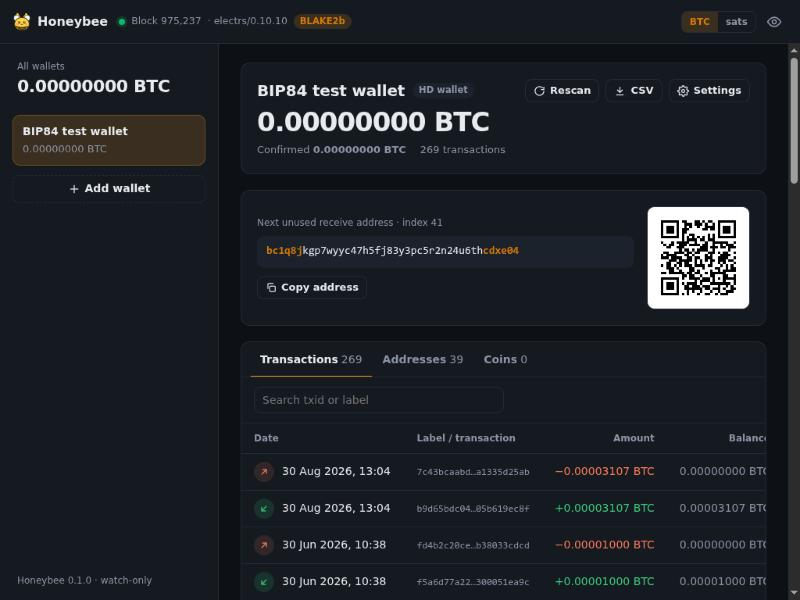

<p align="center"></p>

<h1 align="center">Honeybee</h1>

<p align="center"><b>A self-hosted, watch-only Bitcoin wallet for your own Electrum server.</b></p>

A honeybee watches over the hive's honey without spending it, and Honeybee does the same for your
sats: it keeps an eye on your savings and never touches them.

Honeybee is a single Rust binary that sits next to your node, talks to
[electrs](https://github.com/romanz/electrs) (or any Electrum protocol 1.4 server), and serves a web
UI for checking balances and transaction history. It is *watch-only by construction*: it never sees a
private key and has no code to build, sign or broadcast transactions.



## Features

- **Watch anything public**: xpub / ypub / zpub (and tpub / upub / vpub), output descriptors
  (single-sig, multisig `wsh(sortedmulti(...))`, taproot `tr(...)`, multipath `<0;1>`, key origins and
  checksums), or plain lists of addresses.
- **Balances** (confirmed and pending), **transaction history** with running balance, fees and fee
  rates, **per-address** stats, **UTXO / coin** list, and the **next unused receive address** with a QR code.
- **Live updates**: subscribes to every script hash and to new blocks, so payments show up as soon
  as electrs sees them, without polling.
- **Labels** for transactions, and **CSV export** for bookkeeping.
- **Gap-limit discovery** for HD wallets (configurable per wallet), plus rescan.
- **Bitcoin Knots BLAKE2b hardfork aware**: understands the 164-byte v2 block headers served by the
  [`blake2b` branch of jasonsopko/electrs](https://github.com/jasonsopko/electrs) (see [below](#bitcoin-knots-blake2b-chains)).
- **Self-contained**: one static binary with the UI embedded. No CDN, no external requests, and a
  SQLite file for state.
- **Safe defaults**: password login (scrypt, signed HttpOnly cookies, rate limiting), a strict
  Content-Security-Policy, refuses to listen publicly without a password, and rejects seed phrases
  and private keys if you paste them by mistake.

### What it deliberately does *not* do

No spending, coin control, PSBTs, signing or broadcasting. No price feeds or other third-party
requests: the only server Honeybee talks to is the Electrum server you configure.

## Quick start

### From source

Requires Rust 1.88+.

```bash
git clone https://github.com/YOUR_USER/honeybee && cd honeybee
cargo build --release
./target/release/honeybee --electrum tcp://127.0.0.1:50001
```

Open <http://127.0.0.1:8585> and add a wallet.

To reach it from other machines, set a password and listen on all interfaces:

```bash
read -rs PW && echo "$PW" | ./target/release/honeybee hash-password
# -> scrypt$15$8$1$...
HONEYBEE_PASSWORD_HASH='scrypt$15$8$1$...' ./target/release/honeybee \
  --electrum ssl://electrs.home:50002 --listen 0.0.0.0:8585
```

### Docker

```bash
cp .env.example .env    # set HONEYBEE_ELECTRUM and HONEYBEE_PASSWORD_HASH (write each $ as $$)
docker compose up -d
```

### systemd

See [`contrib/honeybee.service`](contrib/honeybee.service) for a hardened unit file.

## Configuration

Every option is an environment variable or a command-line flag (`honeybee --help`).

| Variable | Default | |
|---|---|---|
| `HONEYBEE_ELECTRUM` | `tcp://127.0.0.1:50001` | Electrum server. `tcp://` for plain, `ssl://` for a TLS stream. |
| `HONEYBEE_ELECTRUM_CA_FILE` | | PEM file with a CA or self-signed certificate to trust (e.g. mkcert's `rootCA.pem`). The OS trust store is always used too. |
| `HONEYBEE_ELECTRUM_INSECURE` | `false` | Skip TLS certificate verification. Only on a network you trust. |
| `HONEYBEE_NETWORK` | `bitcoin` | `bitcoin`, `testnet`, `testnet4`, `signet` or `regtest`. Checked against the server's genesis block. |
| `HONEYBEE_LISTEN` | `127.0.0.1:8585` | Address for the web UI. |
| `HONEYBEE_DATA_DIR` | `./data` | Where `honeybee.db` lives. |
| `HONEYBEE_PASSWORD_HASH` | | Login password hash from `honeybee hash-password`. |
| `HONEYBEE_PASSWORD` | | Plain-text alternative to the hash. |
| `HONEYBEE_NO_AUTH` | `false` | Allow a non-localhost listener without a password (only behind an authenticating proxy). |
| `HONEYBEE_SECURE_COOKIE` | `false` | Mark the session cookie `Secure`. Set it when serving over HTTPS. |
| `HONEYBEE_GAP_LIMIT` | `20` | Default gap limit for new wallets. |
| `HONEYBEE_EXPLORER_URL` | | Base URL of *your own* explorer (e.g. a mempool instance) for tx/address links. No links when unset. |
| `HONEYBEE_LOG` | `info` | Log filter, e.g. `info,honeybee=debug`. |

### HTTPS

Honeybee speaks plain HTTP. For access beyond your LAN, put it behind a TLS reverse proxy (Caddy,
nginx) or reach it over a VPN/Tor, and set `HONEYBEE_SECURE_COOKIE=true`. The clipboard buttons need
HTTPS (or localhost) in most browsers.

```
# Caddyfile
honeybee.example.com {
    reverse_proxy 127.0.0.1:8585
}
```

## Adding wallets

| You paste | Honeybee watches |
|---|---|
| `zpub6r…` | `wpkh(xpub…/<0;1>/*)`: native SegWit, receive and change |
| `ypub6W…` | `sh(wpkh(xpub…/<0;1>/*))`: nested SegWit |
| `xpub6C…` + script type | the same, wrapped as you choose (legacy, nested, native, taproot) |
| `[d34db33f/84h/0h/0h]xpub…` | as above, keeping the key origin |
| `wpkh([…]xpub…/0/*)#checksum` | that chain plus the matching `/1/*` change chain |
| `wsh(sortedmulti(2,[…]xpub1/<0;1>/*,[…]xpub2/<0;1>/*,…))` | a multisig wallet |
| two descriptors on separate lines | receive (first line) and change (second line) |
| `bc1q… 3J98… 1A1z…` | exactly those addresses |

The add dialog previews the first addresses so you can compare them with your wallet before saving.
Where to find the public descriptor: Sparrow (*Settings → Script Policy → Edit… / Export*), Bitcoin
Core (`listdescriptors`), Specter, and most hardware-wallet companion apps.

## How it works

For each wallet, Honeybee derives addresses until `gap_limit` unused ones follow the last used one,
and subscribes to each script hash (`blockchain.scripthash.subscribe`). It only fetches the history
of script hashes whose Electrum *status* changed, downloads the transactions it has not seen (cached
forever in SQLite, since transactions never change) and computes balances, history and UTXOs locally.
Server notifications for new blocks and mempool activity trigger an incremental re-sync.

Fees are exact for transactions that spend your coins. For purely incoming transactions, the parent
transactions (often many, from someone else's wallet) are fetched only when you open that
transaction, because electrs looks each one up through bitcoind and that can be slow.

Honeybee trusts your Electrum server: it does not verify SPV proofs or headers. Use it with a server
you run.

### Compatibility

Developed and tested against **electrs 0.10.x and 0.11.x**. It uses only standard Electrum
protocol 1.4 methods (`server.version`, `server.features`, `blockchain.headers.subscribe`,
`blockchain.block.header`, `blockchain.scripthash.subscribe` / `get_history`,
`blockchain.transaction.get`), so Fulcrum and ElectrumX should work too, but they haven't been tested.

Addresses with very large histories (exchange hot wallets and the like) can take electrs tens of
seconds to answer. Requests time out after two minutes.

### Bitcoin Knots BLAKE2b chains

[Bitcoin Knots #359](https://github.com/bitcoinknots/bitcoin/pull/359) changes block headers from
height 961,640 on mainnet (150,308 on testnet4): blocks may carry a 164-byte "v2" header, flagged by
the top bit of the version field and hashed with BLAKE2b. Transactions, txids, scripts, addresses
and Electrum script hashes are unchanged, so wallets keep working once the server can index the chain.
The [`blake2b` branch of jasonsopko/electrs](https://github.com/jasonsopko/electrs) does that.

Honeybee handles it as follows:

- It reads block times from both header sizes, including the v2 `time_offset` adjustment.
- It never uses `blockchain.block.headers` (plural), which concatenates 80- and 164-byte headers.
- It shows a **BLAKE2b** badge when the chain tip is a v2 header.

Point `HONEYBEE_EXPLORER_URL` at an explorer that follows the same chain (e.g. the
[`knots-blake2b` branch of jasonsopko/mempool](https://github.com/jasonsopko/mempool/blob/knots-blake2b/KNOTS-BLAKE2B.md)),
because public explorers on the original chain won't find post-fork transactions.

## Security and privacy notes

- **Extended public keys are sensitive.** Anyone with your xpub can see all of your past and future
  addresses and balances. Keep Honeybee behind a password and on a network you control.
- The database stores your xpubs/descriptors, labels, and cached transactions. The data directory is created
  owner-only (`0700`); back it up and protect it like the xpubs themselves.
- Explorer links (when configured) go to the explorer you choose, with `Referrer-Policy: no-referrer`.
- The QR code is rendered server-side; nothing is loaded from third parties.

## Development

```bash
cargo test                      # unit tests: BIP44/49/84/86 vectors, descriptors, headers, balance logic
cargo clippy --all-targets
HONEYBEE_LOG=info,honeybee=debug cargo run -- --electrum ssl://electrs.home:50002
```

Layout:

```
src/
  main.rs       startup, CLI
  config.rs     options (flags / environment)
  electrum.rs   Electrum JSON-RPC client over TCP/TLS: reconnects, subscriptions
  wallet.rs     xpub / descriptor / address parsing and derivation
  sync.rs       per-wallet sync, snapshot (balances, history, UTXOs)
  header.rs     80-byte and BLAKE2b v2 header parsing
  store.rs      SQLite: wallets, labels, transaction cache
  auth.rs       scrypt password hashing, signed session cookies
  web.rs        HTTP API, SSE events, embedded UI
static/         the web UI (vanilla JS, no build step)
```

## License

MIT. See [LICENSE](LICENSE).
